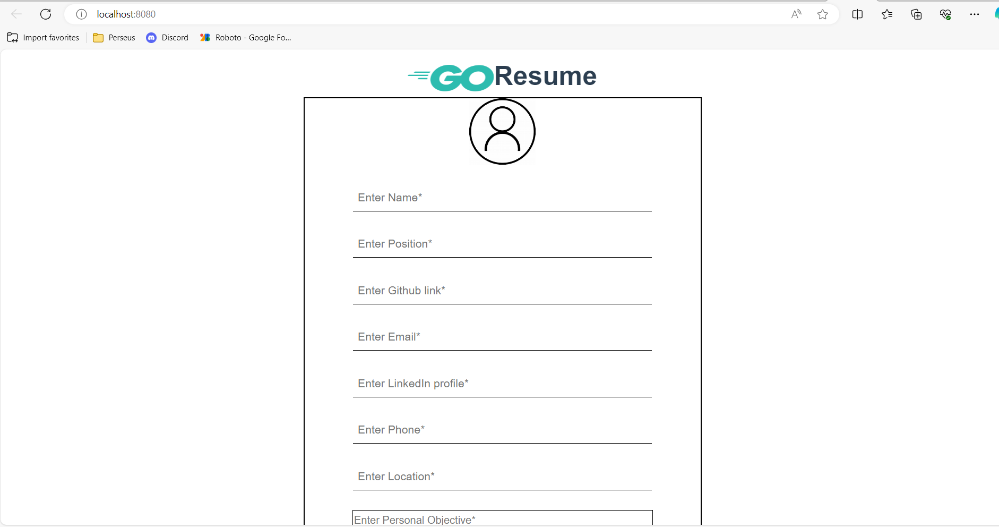
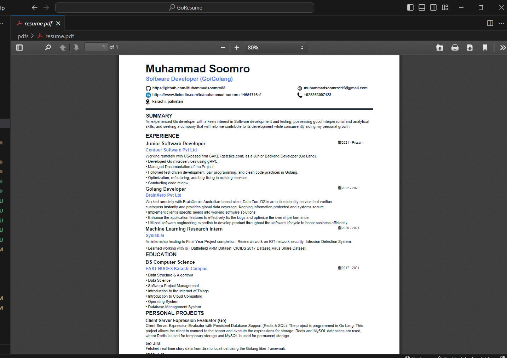

# go-resume
The aim of this project is to develop a software solution that efficiently generates professional resumes for our esteemed clientele. By utilizing cutting-edge technology and incorporating 
user-friendly features, our project aims to streamline the resume creation process, enabling users to create impressive resumes with minimal effort. We believe that this project will 
greatly enhance our clients' job search experience and contribute to their overall career success.
Tech used: `Vue.js` & `Go`

### Features:
- Build your resume without registration
- Save as json file and upload and use in future
- Export as PDF (selectable text)

### Run Development Mode
For frontend cd into resumeui and run
```
npm install
```

```
npm run serve
```

For backend, stay on root dir and run
```
go run main.go
```

### UI


Once you finish adding up all the info hit Generate button and your resume will be downloaded into `pdfs/` location in project structure.

### Resume (.PDF)

